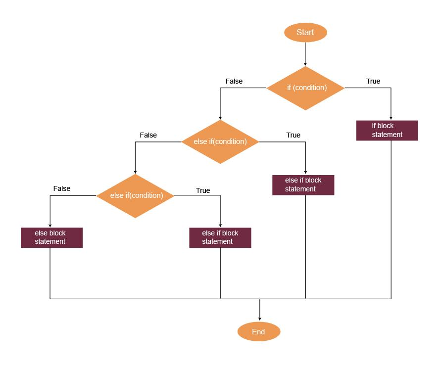
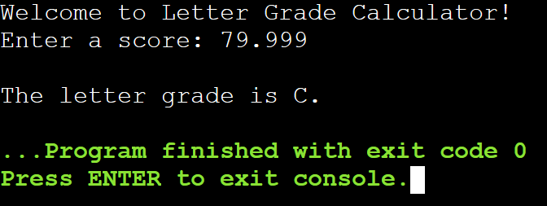

# Lab Assignment 06

In this lab you will practice working with decision making statements.

Same as the previous labs, you need to set up your workspace (class and main() method).

## Let's get started!

First, let's look at the name of our .java file in the `src/` directory and name your class accordingly and remember to make it `public`. Next, **create your main() method inside your class**.

Now let's begin!

### Decision Making Statements

Exactly the same as C++. But let's refresh anyways. 

Java has the same decision making statements as C++: `if`, `else`, `else if`, and `switch`.

For more information on decision making in Java visit: https://www.w3schools.com/java/java_conditions.asp  and https://www.w3schools.com/java/java_switch.asp

## Your Assignment

### Letter Grade Calculator

Assume you are a school teacher working at Texas High and you have decided to write a program to help you assign a letter grade to your students based on their scores.

Here is the criteria for assigning a letter grade:

| Score Range | Letter Grade |
| ---- | ---- |
| 0 - 59 | F |
| 60 - 69 | D |
| 70 - 79 | C |
| 80 - 89 | B |
| 90+ | A |

**Remember:** Grade scores usually invovle decimal values.

**Note:** If the teacher inputs a negative number, let them know "Oops you input a negative value".

**Expected Output:**

## Submit your assignment

To submit your lab assignment click on the source control icon (3 circles with 2 lines) on your leftside navbar. Next, click on the '+' symbol next to "Changes" to stage your changes. Lastly, add a commit message (ex: "First commit") and click "Commit" then "Push" or "Sync Changes". And you're done!